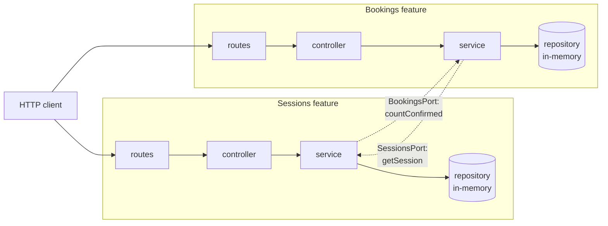

# Dabble - ClassPass but for every hobby
## Demo app for observing context engineering techniques

A small backend powering a hobby-trial booking platform — users discover and book sessions across heterogeneous activities (tennis, pilates, dance, hiking, pottery, climbing). Built as a demo for observing AI code agents at work.

## Stack

TypeScript · Express · zod · node:test + supertest · OpenTelemetry (traces + metrics + logs over OTLP, exported to Coralogix) · in-memory persistence (swap-in port for SQL later).

## Architecture



Each feature is self-contained (`src/features/<name>/`):

- **routes** — declarative URL → handler wiring with `@openapi` JSDoc
- **controller** — HTTP only: validates input, calls service, shapes response (most response shaping is now done in the service for sessions; controllers are thin)
- **service** — business logic, factory-injected repository + cross-feature ports, throws typed domain errors (`NotFoundError`, `CapacityFullError`, `DuplicateBookingError`)
- **repository** — persistence port + in-memory adapter; one file changes when SQL lands
- **schemas/** — zod-defined `Input` / `Stored` / `Response` model layers (single source of truth for validation, types, and OpenAPI components)
- **mappers** — pure transforms between layers

Cross-feature talk happens over typed ports (the dotted arrows above). Today they're satisfied by in-process adapters; when sessions or bookings extracts into its own service, only the adapter changes — feature code stays put. Ports are async-shaped from day one so the eventual HTTP migration doesn't require a sync→async refactor.

Domain errors thrown anywhere flow through `asyncHandler` to a single `DomainError` middleware in `app.ts`, which reads `err.statusCode` to render the response.

## Endpoints

### Health

| Method | Path | Notes |
|---|---|---|
| `GET` | `/health` | uptime + timestamp |

### Sessions

A session is a bookable activity created by a host (capacity, location, time, etc.).

| Method | Path | Notes |
|---|---|---|
| `GET`    | `/sessions`     | list all sessions |
| `GET`    | `/sessions/:id` | get a session (`bookedCount` / `availableSpots` / `isFull` are derived from real bookings) |
| `POST`   | `/sessions`     | create a session |
| `PUT`    | `/sessions/:id` | update a session |
| `DELETE` | `/sessions/:id` | delete a session |

### Bookings

A booking is a user's claim on a session. References `sessionId`. Bookings have **no PUT** — they are cancelled and recreated, not edited.

| Method | Path | Notes |
|---|---|---|
| `GET`    | `/bookings`         | list all bookings |
| `GET`    | `/bookings?attendeeName=X` | list bookings for a specific attendee (includes cancelled) |
| `GET`    | `/bookings/:id`     | get a booking |
| `POST`   | `/bookings`         | create a booking — `404` if session unknown, `409` if session full or attendee already has a confirmed booking |
| `DELETE` | `/bookings/:id`     | cancel a booking (soft delete: row stays with `status='cancelled'`) |

### Docs

| Method | Path | Notes |
|---|---|---|
| `GET` | `/docs` | Swagger UI (zod schemas → OpenAPI) |

## Quick start

```bash
npm install
cp .env.example .env       # fill in Coralogix creds (or leave blank for local-only)
```

**Run with persistence (Postgres):**

```bash
docker compose up -d       # starts postgres on localhost:5432
npm run db:migrate         # applies migrations under ./migrations
npm start                  # http://localhost:3000
```

**Run without persistence (in-memory, state lost on restart):**

```bash
# Unset DATABASE_URL in .env (or comment it out), then:
npm start
```

```bash
npm test          # run all tests (uses the in-memory adapter)
npm run check     # type-check (tsc --noEmit)
npm run db:generate  # generate a new migration from schema changes
```

### Database

Postgres-backed via [Drizzle](https://orm.drizzle.team/). The repository port has two adapters — an in-memory `Map` (for tests and quick local runs) and a Postgres one. The service picks based on `DATABASE_URL`:

- **Set** → Postgres (via the pool in `src/db/index.ts`, auto-instrumented by OTel)
- **Unset** → in-memory `Map`

Schema lives in `src/db/schema/`; migrations live in `./migrations/` and are committed to the repo.

## Out of scope for now

- **Auth.** Endpoints are open; bookings identify users by `attendeeName` until auth lands.
- **Persistence.** In-memory `Map`s — state is lost on restart.
